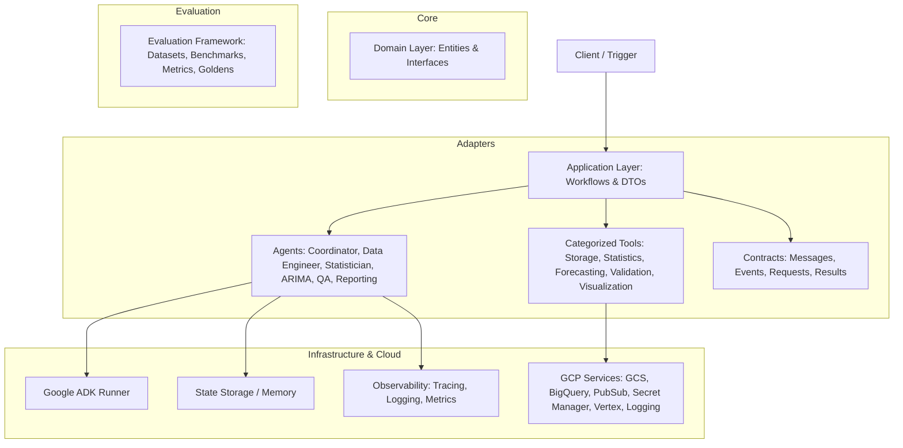

# ARIMA Agent Platform - System Architecture

## 1. Overview
ARIMA Agent Platform is an enterprise-ready, multi-agent platform designed to orchestrate, execute, and evaluate time series forecasting workflows using Google ADK and Clean Architecture principles.

---

## 2. High-Level Architecture Diagram

---

## 3. Layer Architecture Breakdown

| Layer | Path | Description |
| :--- | :--- | :--- |
| **Domain** | `src/arima_agent_platform/domain/` | Enterprise Entities, Value Objects, Domain Interfaces, Exceptions. |
| **Application** | `src/arima_agent_platform/application/` | DTOs, Service Interfaces, and Workflow Orchestrators. |
| **Adapters** | `src/arima_agent_platform/adapters/` | Agent protocols, Categorized Tools, and Data Contracts. |
| **Infrastructure** | `src/arima_agent_platform/infrastructure/` | GCP wrappers, ADK Runner, State Repositories, Observability. |
| **Evaluation** | `src/arima_agent_platform/evaluation/` | Datasets, Benchmarks, Metrics, and Golden Datasets. |
| **Prompts** | `src/arima_agent_platform/prompts/` | Agent System Prompt Markdown Templates. |
