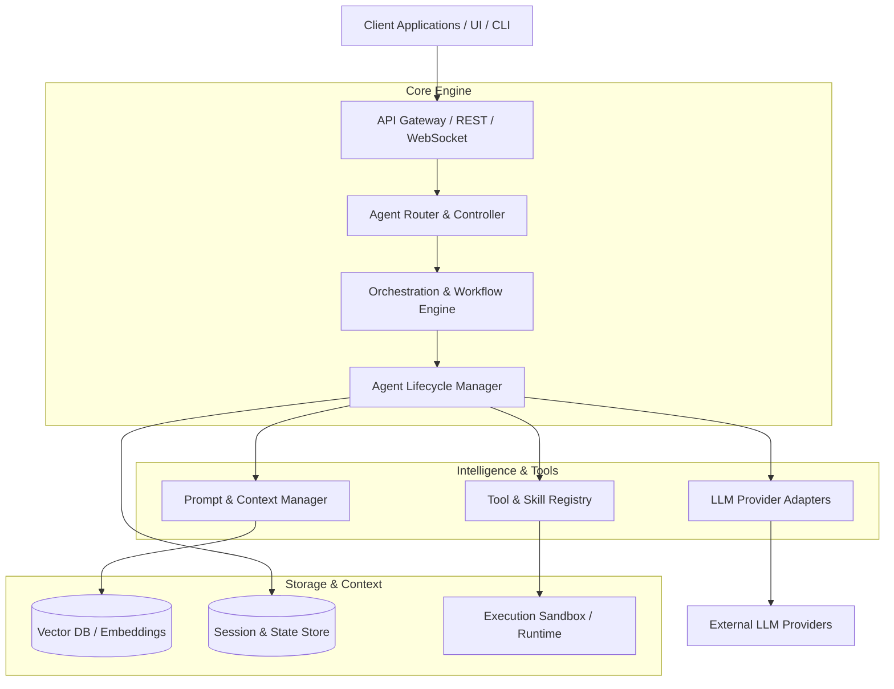

# ARIMA Agent Platform - System Architecture

## 1. Overview
ARIMA Agent Platform is an extensible, enterprise-ready platform designed to orchestrate, execute, and monitor autonomous AI agents. The platform provides a modular framework for managing multi-agent collaboration, tool integration, context/memory management, and seamless deployment.

---

## 2. High-Level System Architecture

---

## 3. Core Components

### 3.1. API Gateway & Transport Layer
- **REST / gRPC APIs**: Primary interface for external services, user applications, and administration.
- **WebSocket / Event Streams**: Real-time bidirectional communication for streaming agent responses, status updates, and interactive feedback.

### 3.2. Orchestration & Workflow Engine
- **Task Dispatcher**: Schedules and queues tasks based on priority, dependencies, and available resources.
- **Multi-Agent Coordination**: Supports sequential, hierarchical, and collaborative multi-agent communication patterns.

### 3.3. Agent Runtime & Lifecycle Manager
- **Agent Instance Management**: Controls initialization, execution, pause, resume, and termination of active agent sessions.
- **State & Memory Management**: Manages short-term conversation context, persistent memory, and long-term knowledge retrieval.

### 3.4. LLM & Model Adapters
- Multi-provider support (OpenAI, Anthropic, Google Gemini, Local Models via Ollama/vLLM).
- Standardized provider abstraction layer supporting streaming, structured outputs, and function calling.

### 3.5. Tool & Skill Registry
- Dynamic discovery and binding of tools (APIs, Code Interpreters, Web Browsers, File Systems).
- Sandboxed tool execution environment for security and resource isolation.

---

## 4. Data & Memory Layer

| Component | Technology / Usage | Description |
| :--- | :--- | :--- |
| **Session Store** | Redis / PostgreSQL | Manages active sessions, transient states, and real-time events. |
| **Vector DB** | Qdrant / Pinecone / pgvector | Stores embeddings for semantic search, long-term memory, and RAG capabilities. |
| **Artifact Store** | S3 / MinIO / Local FS | Stores generated files, execution logs, and output media. |

---

## 5. Security & Isolation

- **Authentication & RBAC**: Role-based access control for API endpoints and resource access.
- **Sandboxing**: Containerized (Docker/MicroVM) execution environment for untrusted dynamic code execution.
- **Secret Management**: Secure credential injection for tool execution without exposing keys to agents.

---

## 6. Development & Deployment

- **Containerization**: Standard Docker & Docker Compose setup for local development and microservice deployment.
- **Monitoring & Telemetry**: OpenTelemetry tracing, structured logging, and metrics monitoring for agent runs.
